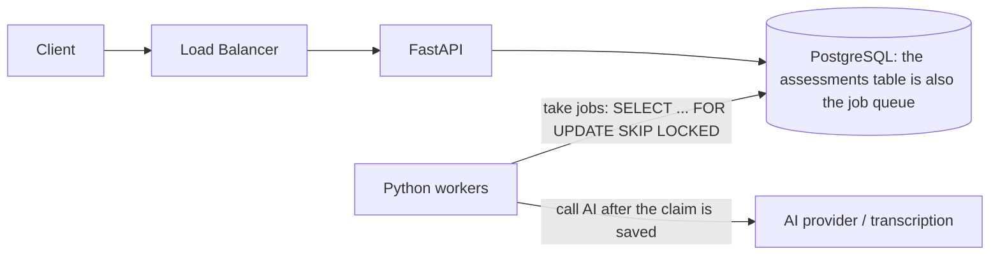
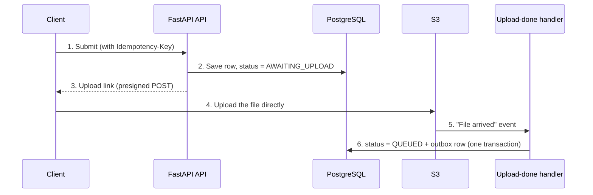
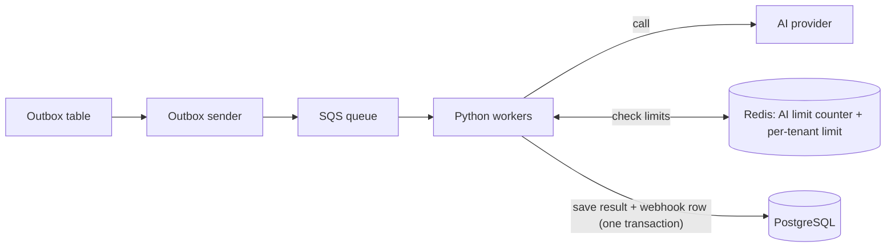
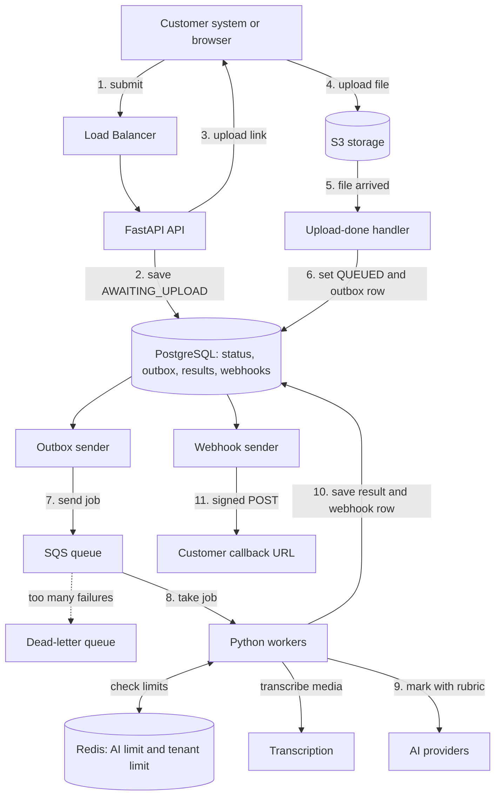

# Design an AI Assessment Evaluation Platform (90-Minute Plan)

* **What it is:** A backend that receives assessments (text, code, audio, video), marks them with AI in the background, and sends the results to the customer's system.
* **Tech stack:** Python, FastAPI, PostgreSQL, SQLAlchemy, AWS (ALB, ECS, S3, SQS), Redis, webhooks
* **Role:** Senior Backend Engineer

> **How to use this note.** This is a worked example, not a script to memorise. The interviewer may change the rules in the middle. So learn the **reason** behind each choice (marked **Why**). Always start with the simple design, and make it bigger only when a requirement forces you to.

---

## Words used in this note

| Word | Simple meaning |
|---|---|
| **Idempotent** | Doing it twice gives the same result as doing it once. Safe to retry. |
| **At-least-once** | A message may arrive more than once, but it will never be lost. |
| **Lease** | A time-limited "this job is mine" lock. If the worker dies, the lock expires and another worker can take the job. |
| **Outbox** | A table where we save "send this message" in the same transaction as our data change. A separate process sends it later. This way we never save data and forget the message. |
| **Tenant** | One customer company (for example, a university). |
| **Noisy neighbour** | One tenant that sends so much work that other tenants have to wait. |
| **TPM** | Tokens per minute. The AI provider's limit on how much text we can send. |

---

## 1. The Problem

### What the system must do
1. **Accept** an assessment. Large files (video, audio) go straight to S3.
2. **Process** it in the background. AI marks it using a rubric (the marking rules).
3. **Show status.** The customer can ask "is it done yet?".
4. **Notify.** When it is done, we call the customer's URL (a webhook).

### Targets
* **Volume:** 3 million assessments per month.
* **Speed:** 95% of assessments marked within 2-5 minutes after upload. The submit API answers in under 50 ms.
* **No data loss:** Once we say "accepted", it must never disappear.
* **Safe retries:** A duplicate request or message must not create a second assessment, a second score, or a second AI charge.
* **Fair:** One big customer must not block small customers.
* **Within AI limits:** We must stay inside the provider's rate limits and track cost.
* **Traceable:** For every result we know which rubric, model and prompt were used.

### Questions to ask the interviewer first
* Does a human need to approve results before the customer sees them?
* What is the biggest burst (how many assessments in the worst 5 minutes)?
* What is our AI provider limit? Can we use a second provider?
* How long do we keep student data? Are there privacy rules (like GDPR)?
* Does video need to be turned into text first (transcription)?

---

## 2. Quick Math

### Requests
* 3,000,000 per month is about 100,000 per day.
* 100,000 ÷ 86,400 seconds is about **1.2 per second** on average.
* Short bursts (exam time) can be 100 times more: **120-150 per second** for a minute or two.
* The API only checks the request and saves a small record, so 3-5 small servers are enough.

### Storage
* About 20 KB of data per submission is about 60 GB per month. PostgreSQL handles this easily.
* About 30% have media of about 15 MB. That is about **450 GB per day**, or **13.5 TB per month**.
* **Decision:** media never goes through our API. The client uploads directly to S3.

### How many workers? (size it for the burst, not for the peak)
Running 100 jobs per second all day would be more than our daily total. So we ask: *how fast must we clear a burst?*

```
Burst:            150 per second for 60 seconds   = 9,000 jobs
Goal:             clear them in 5 minutes (300 s) = 30 jobs per second
Time per job:     about 30 seconds
Jobs in progress: 30 × 30                         = about 900 at the same time
Workers:          900 ÷ (50-100 per container)    = about 10-20 containers
```

Scale workers by **how old the oldest waiting job is**, not by CPU. The work is mostly waiting for the AI, so async Python (`asyncio` + `httpx`) fits well.

### The real limit is the AI provider, not the workers
```
Needed:    30 jobs/s × about 3,000 tokens = 90,000 tokens/s = 5.4 million tokens/minute
Typical:   a provider limit of about 1 million tokens/minute = about 5.5 jobs/s
Result:    a 9,000-job burst takes about 27 minutes. That breaks our 5-minute goal.
```
More workers will not fix this. Say the options out loud: a higher provider tier, a second provider, a smaller and cheaper model for easy items, shorter prompts, caching, batch mode for non-urgent customers, or a longer SLA for batch work.

### Video and audio need an extra step
Video is not one simple AI call. First we must turn speech into text (transcription), then mark the text. So the flow is: **upload → transcribe → mark**. A managed transcription service can do this.

---

## 3. Architecture

### 3.0 Time plan for 90 minutes

| Time | What to do |
|---|---|
| 0-10 min | Requirements and questions |
| 10-20 min | Math and API |
| 20-40 min | Simple design, then make it bigger |
| 40-70 min | Deep dives (fairness, retries, AI limits, webhooks) |
| 70-85 min | Failures, monitoring, security |
| 85-90 min | Summary and trade-offs |

### 3.1 Start simple (draw this first)

At this size, **PostgreSQL itself can be the queue**.



* The submission and its job status are in **one row**, saved in **one transaction**.
* A worker takes a job, sets a **lease**, saves it, and **only then** calls the AI.
* **Why:** One database to run. No "saved the data but lost the message" problem. Good for a small team.
* **When to grow:** when the database is too busy with job traffic, when you need several independent consumers, or when you want queue features like dead-letter queues. Then use the bigger design below.

### 3.2 Step 1: Upload and hand-off



* Text-only submissions skip the upload step and go straight to `QUEUED`.
* **Only add the job after the file is really uploaded.** If we added it earlier, a worker could start before the file exists.

### 3.3 Step 2: Background processing (bigger design)



* The **outbox** makes sure a saved change always leads to a queue message. The sender retries until it works. Workers must still handle repeats, because a message can be sent twice.
* **Why a standard queue, not FIFO?** FIFO makes each tenant run one job at a time. See Deep Dive 1.

#### What are the outbox table and the outbox sender?

**The problem:** saving to PostgreSQL and sending to SQS are two separate actions. If the server crashes between them, the assessment is saved as `QUEUED` but no message was sent, so nobody ever processes it. If you send first, you can send a message for something that was never saved. One transaction cannot cover both systems.

**The fix:** save the "send this message" request in the database, in the same transaction as the data change.

* **Outbox table:** a normal PostgreSQL table (`outbox_events` in section 4), written in SQL and created with a migration (for example Alembic). When the assessment becomes `QUEUED`, the code writes the assessment row **and** an outbox row in **one transaction**. Either both exist or neither does.
* **Outbox sender:** Python code that **you write**. It is not a library, and it is not a one-time script. It is a small **long-running process**, usually its own ECS service (or part of the worker app). It loops: read unsent rows, send each to SQS, then mark the row as sent. If it crashes, or SQS is down, the row stays unsent and the next loop retries it. So no job is lost.

```python
import asyncio

async def run_outbox_sender():
    while True:
        async with session_factory() as session:
            # SKIP LOCKED lets several senders run at the same time without clashing
            rows = await session.execute(text("""
                SELECT id, payload FROM outbox_events
                WHERE published_at IS NULL
                ORDER BY created_at
                LIMIT 50
                FOR UPDATE SKIP LOCKED
            """))
            for row in rows:
                sqs.send_message(QueueUrl=QUEUE_URL, MessageBody=row.payload_json)
                await session.execute(
                    text("UPDATE outbox_events SET published_at = now() WHERE id = :id"),
                    {"id": row.id},
                )
            await session.commit()
        await asyncio.sleep(0.5)   # short pause when there is nothing to send
```

**The catch:** if the sender sends a message and crashes before it marks the row as sent, the message is sent **again**. So the same job can arrive twice. This is why workers must be idempotent (see Deep Dive 2).

**Other ways to run the sender:**
* A scheduled job (EventBridge or cron) every minute. It is simpler but adds up to a minute of delay.
* Change-data-capture tools such as Debezium. They are powerful but add another system to run, which is too heavy for a small team.

**Is it always needed?** No. In the simple design (3.1) the PostgreSQL table is the queue, so there is no second system and no outbox. The outbox is the price of adding SQS. Say this in the interview: "a small Python loop running as its own ECS service; safe to run several copies because of SKIP LOCKED."

### 3.4 Step 3: Production safety
* **Connection pool:** RDS Proxy or PgBouncer in front of the database.
* **AI limits:** a shared counter in Redis, plus a per-tenant limit on running jobs.
* **Webhook sender:** reads the `webhook_deliveries` table, retries with waiting time, and stops safely after the last attempt.
* **Self-hosted AI models (optional):** only if cost or data rules justify the extra work. Otherwise use managed AI APIs.

### Full diagram (bigger design)



---

## 4. API and Database

### Submit: `POST /v1/assessments`

Required header: `Idempotency-Key: <unique value from the client>`.

**The tenant comes from the login credentials, never from the request body.** If it came from the body, a caller could pretend to be another customer.

```json
// Request
{
  "candidate_id": "cand_88219",
  "assessment_type": "VIDEO_INTERVIEW",
  "rubric_id": "rubric_lead_backend",
  "content_type": "video/mp4",
  "metadata": { "job_id": "job_3910" }
}

// Response: 201 Created
// (if the same Idempotency-Key is sent again: 200 with the same body)
{
  "assessment_id": "asm_550e8400-e29b",
  "status": "AWAITING_UPLOAD",
  "upload": {
    "url": "https://eval-bucket.s3.amazonaws.com/",
    "fields": { "key": "asm_550e8400-e29b/input.mp4", "policy": "...", "x-amz-signature": "..." }
  },
  "upload_expires_in": 900
}
```

* Use a **presigned POST** with a file-size limit. A presigned `PUT` cannot limit the size.
* Other endpoints:
  * `POST /v1/assessments/{id}/complete` - client says "upload finished". We check the file exists.
  * `GET /v1/assessments/{id}` - status and result.
  * `GET /v1/assessments?status=&cursor=` - list, with cursor paging.
* Rate-limit each tenant. Return `429` with `Retry-After`.

### Database tables

```sql
CREATE TABLE tenants (
    id VARCHAR(64) PRIMARY KEY,
    name VARCHAR(255) NOT NULL,
    concurrency_limit INT NOT NULL DEFAULT 20,   -- max jobs running at once for this tenant
    created_at TIMESTAMPTZ DEFAULT NOW()
);

CREATE TABLE assessments (
    id UUID PRIMARY KEY DEFAULT gen_random_uuid(),
    tenant_id VARCHAR(64) NOT NULL REFERENCES tenants(id),
    idempotency_key VARCHAR(128) NOT NULL,
    candidate_id VARCHAR(128) NOT NULL,
    -- AWAITING_UPLOAD, QUEUED, PROCESSING, COMPLETED, NEEDS_REVIEW, FAILED
    status VARCHAR(32) NOT NULL DEFAULT 'AWAITING_UPLOAD',
    raw_s3_uri TEXT,
    rubric_id VARCHAR(64) NOT NULL,
    rubric_version INT NOT NULL,                 -- exact rubric version used
    -- worker lease and retry state
    locked_by VARCHAR(64),
    locked_until TIMESTAMPTZ,
    attempt_count INT NOT NULL DEFAULT 0,
    run_after TIMESTAMPTZ NOT NULL DEFAULT NOW(),
    error_code VARCHAR(64),
    -- result
    overall_score NUMERIC(5, 2),
    eval_breakdown JSONB,                        -- flexible AI output
    model_version VARCHAR(64),
    prompt_version VARCHAR(64),
    token_usage JSONB,
    reviewed_by VARCHAR(128),                    -- human reviewer, if any
    reviewed_at TIMESTAMPTZ,
    created_at TIMESTAMPTZ DEFAULT NOW(),
    updated_at TIMESTAMPTZ DEFAULT NOW(),
    UNIQUE (tenant_id, idempotency_key)          -- stops duplicate requests
);

-- Only active rows are indexed, so the index stays small and fast
CREATE INDEX idx_assessments_active ON assessments (status, run_after)
    WHERE status IN ('QUEUED', 'PROCESSING');
CREATE INDEX idx_assessments_tenant_status ON assessments (tenant_id, status, created_at);
-- Add a GIN index on eval_breakdown ONLY if you really search inside it.
-- It makes every write slower.

CREATE TABLE outbox_events (                     -- used in the bigger design
    id UUID PRIMARY KEY DEFAULT gen_random_uuid(),
    assessment_id UUID NOT NULL REFERENCES assessments(id),
    event_type VARCHAR(64) NOT NULL,
    payload JSONB NOT NULL,
    created_at TIMESTAMPTZ DEFAULT NOW(),
    published_at TIMESTAMPTZ                     -- empty = not sent yet
);

CREATE TABLE webhook_deliveries (                -- also works as the webhook outbox
    id UUID PRIMARY KEY DEFAULT gen_random_uuid(),   -- sent to the customer as event_id
    assessment_id UUID NOT NULL REFERENCES assessments(id),
    destination_url TEXT NOT NULL,
    status VARCHAR(16) NOT NULL DEFAULT 'PENDING',   -- PENDING, DELIVERED, FAILED
    attempts INT NOT NULL DEFAULT 0,
    next_attempt_at TIMESTAMPTZ NOT NULL DEFAULT NOW(),
    last_http_status INT,
    last_error TEXT,
    delivered_at TIMESTAMPTZ
);
CREATE INDEX idx_webhooks_due ON webhook_deliveries (next_attempt_at) WHERE status = 'PENDING';
```

* A webhook failure is saved on `webhook_deliveries`, **not** on the assessment. If the customer's server is down, the marked result is still valid.

---

## 5. Deep Dives

### Deep Dive 1: Fairness (the noisy neighbour)
* **Problem:** Client A uploads 50,000 assessments. Client B uploads 1. With one shared line, B waits for hours.
* **Why not SQS FIFO with `MessageGroupId = tenant_id`?** FIFO keeps strict order inside a group. It will not give out the next message of a group while one is still running. So Client A's jobs would run **one at a time**: 50,000 × 30 s is about 17 days. That is the opposite of what we want, and we do not need strict order here.
* **Better options (simplest first):**
  1. **Simple design (PostgreSQL queue):** the claim query skips tenants that are already at their `concurrency_limit`, and rotates between tenants that have waiting work. This works, but it gets complicated, which is one reason to move to a real queue.
  2. **SQS fair queues:** use a **standard** queue with `MessageGroupId = tenant_id`. AWS's fair-queue feature stops one busy tenant from slowing the others. Check the current AWS docs for details and limits.
  3. **Redis slot per tenant:** before a job starts, the worker takes a slot in Redis (counter with expiry). If the tenant is at its limit, put the message back with a short delay.
* **Also:** rate-limit each tenant at the API, and track AI spend per tenant so one tenant cannot use the whole token budget.

### Deep Dive 2: Retries without duplicates (idempotency)
Use **three layers**:
1. **API:** `UNIQUE (tenant_id, idempotency_key)`. If the same request comes again, return the first assessment.
2. **Taking a job:** a conditional update with a lease, so only one worker owns the job at a time.
3. **Saving the result:** only save if this worker still owns the job:
   ```sql
   UPDATE assessments
      SET status = 'COMPLETED', overall_score = $1, eval_breakdown = $2, model_version = $3
    WHERE id = $4 AND status = 'PROCESSING' AND locked_by = $5;
   -- 0 rows changed = we lost the lease, so throw our result away
   ```

Save the result and the `webhook_deliveries` row in **one transaction**.

**Why not trust FIFO de-duplication?** It only covers 5 minutes, and it does not stop a message from being delivered again after a timeout. Queues are at-least-once, so the **database** must protect correctness.

### Deep Dive 3: Async workers and AI limits
* **Problem:** Providers limit requests and tokens per minute. Bursts cause `429` errors and wasted retries.
* **What to do:**
  * **Shared token counter in Redis:** before each call, a Lua script subtracts the estimated tokens. After the call, correct it with the real number. A `429` means "slow down and wait for `Retry-After`". It does not mean "the provider is broken".
  * **If Redis is down:** use a small fixed limit per worker. Do not allow unlimited calls.
  * **Timeouts:** each AI call gets `asyncio.timeout(45)`. The whole job also has a deadline (for example 5 minutes).
  * **Heartbeat:** every ~30 seconds, extend the lease (or SQS visibility timeout) while the job runs. It must cover the whole job, not just one call.
  * **Never keep a database session open during a slow call.** Take the job and commit. Call the AI. Then open a short transaction to save the result.
* **Check the AI output:** ask for structured output and validate it against a schema. If it is invalid, retry a few times. If it keeps failing, send the job to `NEEDS_REVIEW`.

### Deep Dive 4: Database connections
* **Problem:** Many worker pods can use up all PostgreSQL connections.
* **What to do:**
  * Use **RDS Proxy or PgBouncer**. But watch for **pinning**: with `asyncpg`, prepared statements can lock a connection to one client, and then the proxy cannot share it. Turn off the statement cache (`statement_cache_size=0`) and watch the proxy's pinned-connection metric.
  * Workers use the database only for a moment (take the job, save the result). So keep pools small. Check that `pool_size × number of pods` stays below the database `max_connections`.
    ```python
    engine = create_async_engine(
        settings.DATABASE_URL,
        pool_size=3,
        max_overflow=2,
        pool_recycle=1800,
        pool_pre_ping=True,
        connect_args={"statement_cache_size": 0},  # avoids pinning behind a proxy
    )
    ```

### Deep Dive 5: Reliable webhooks
* **Problem:** Customer servers are often slow or down.
* **What to do:**
  * The delivery row is saved in the same transaction as the result. A sender picks rows with `status = 'PENDING' AND next_attempt_at <= now()`. To retry later, just change `next_attempt_at`. This also avoids the 15-minute delay limit of SQS.
  * **Wait times:** now, 10 s, 1 min, 5 min, 30 min, 2 h, 12 h. After the last try, mark the delivery `FAILED`, alert, and show it on the customer dashboard with a **Replay** button. A failed webhook never changes the assessment status.
  * **Signing:** HMAC-SHA256 over `timestamp + body`, sent in `X-Signature-SHA256`, with the timestamp in a header. The customer can reject old messages (replay attacks).
  * **Rules for customers:** delivery is at-least-once and may arrive out of order. Each message has a unique `event_id` and a result version, so the customer can drop duplicates and old updates. Use a short timeout (about 10 s). Only a 2xx reply means success.

### Deep Dive 6: Quality, versions and human review
* Save `rubric_version`, `model_version` and `prompt_version` with every result. Then you can always explain a score.
* Keep a **golden set** of answers already marked by humans. Run it every time a prompt or model changes. Watch score patterns in production for drift.
* Send low-confidence, repaired, flagged or high-stakes results to `NEEDS_REVIEW`. Save the reviewer's decision and keep an audit trail. Decide: does a re-mark make a new version or replace the old one?
* Treat marking as a versioned interface (input, output schema, version). AI engineers can then change the inside without a backend release.

---

## 6. Failures, Monitoring and Security

1. **Worker crashes (out of memory, deploy):** workers stop taking new jobs on `SIGTERM` and finish current work. If a worker is killed, its lease expires. A **reconciler** (a small job that runs often) moves the job back to `QUEUED` and adds 1 to `attempt_count`. After too many tries, move it to the dead-letter / `NEEDS_REVIEW` path. Idempotent saves make the re-run safe.
2. **AI provider outage:**
   * `429` → slow down and wait.
   * Many `5xx` errors or timeouts (for example over 30% for 2 minutes) → **circuit breaker** opens: pause taking jobs (they stay safe in the queue), switch to a second provider if allowed, and page the on-call person.
3. **Poison messages (jobs that always fail):** limited retries with waiting time, then the dead-letter queue, with an alert and a safe replay procedure.
4. **Tracing:** pass one correlation ID (OpenTelemetry) through API → outbox → queue → worker → AI → database → webhook. Never log candidate answers or media.
5. **Alert on:**
   * age of the oldest waiting job (this is the SLA signal)
   * time from submit to result
   * waiting jobs per tenant
   * tokens used compared with the budget
   * provider error rate
   * retries and dead-letter count
   * webhook success rate and delay
   * database connections and slow queries
6. **Security and privacy:**
   * take the tenant from credentials only
   * filter every query by `tenant_id`
   * use a separate webhook secret per tenant
   * store secrets in a secrets manager
   * encrypt data in transit and at rest
   * keep S3 buckets private
   * check file size and type (and scan for malware if files can be anything)
   * delete student data on schedule
   * test your backups by restoring them

---

## 7. Trade-offs Summary

* **PostgreSQL queue vs SQS:** PostgreSQL is simpler and transactional at this size. SQS gives managed delivery, dead-letter queues and fairness, but needs the outbox and one more system. Start simple and move when you have a measured reason.
* **SQS vs Kafka:** We need task processing, not an event log we can replay. SQS is much less work to run for a small team.
* **Standard vs FIFO queue:** FIFO's strict order makes each tenant run one job at a time. We need parallel work, so use standard and handle fairness separately.
* **Presigned S3 upload vs upload through the API:** Direct upload protects the API from big files, but we must add the "file arrived" hand-off and a server-side size limit.
* **PostgreSQL + JSONB vs NoSQL:** Normal columns give safe status changes, unique constraints and audit trails. JSONB holds changing AI output without migrations.
* **Managed AI vs self-hosted models:** Self-hosting means GPU planning and on-call work. Do it only for cost at large volume or data rules. Otherwise use managed APIs with a backup provider.
* **Token budget vs worker count:** When the provider limit is the bottleneck, more workers do not help. Use a higher tier, a second provider, a cheaper model, caching, or different SLAs.

---

## 8. Checklist Before the Interview

- [ ] Can I draw the simple PostgreSQL-queue design first, and say when I would grow it?
- [ ] Do I add the job only **after** the upload is confirmed?
- [ ] Do I have idempotency in three places: API, taking the job, saving the result?
- [ ] Can I explain **why FIFO with a tenant group ID is wrong** and what I would use?
- [ ] Can I show the worker math **and** that tokens per minute is the real limit?
- [ ] Do I treat video/audio as a separate transcription step?
- [ ] Do I avoid holding a database session during AI calls? Do I know the RDS Proxy pinning problem?
- [ ] Do webhooks have signing with a timestamp, event IDs, waiting between retries, and a replay option?
- [ ] Is every result tied to the rubric, model and prompt version, with a human-review path?
- [ ] Do I take the tenant from the login, not from the request body?
