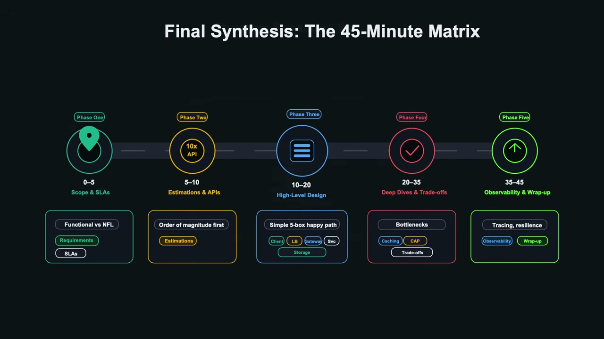
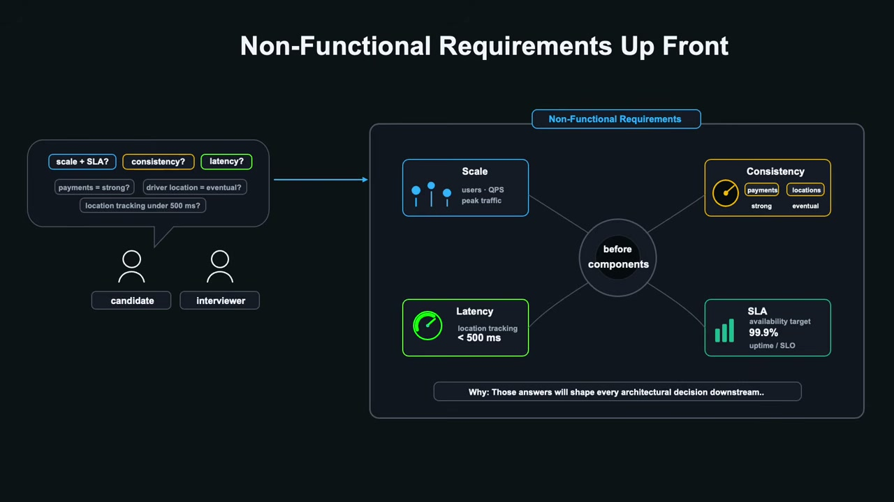
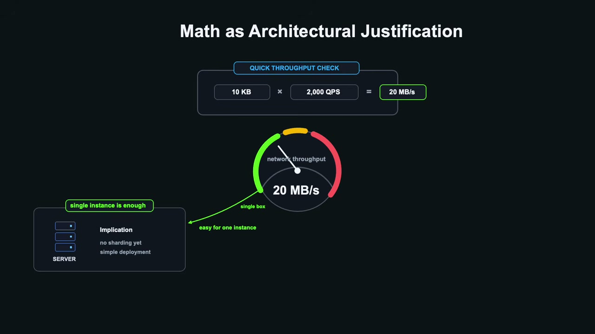
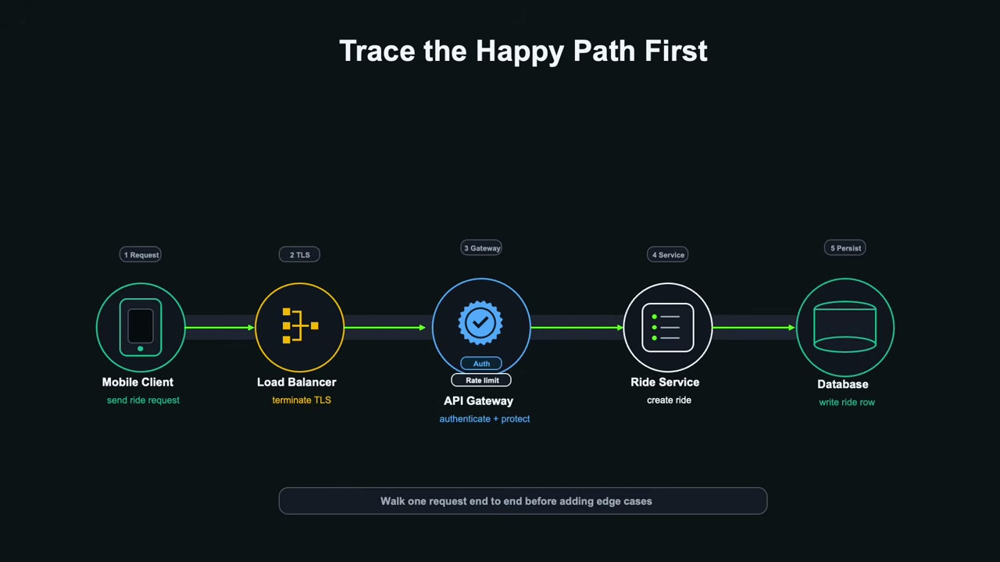
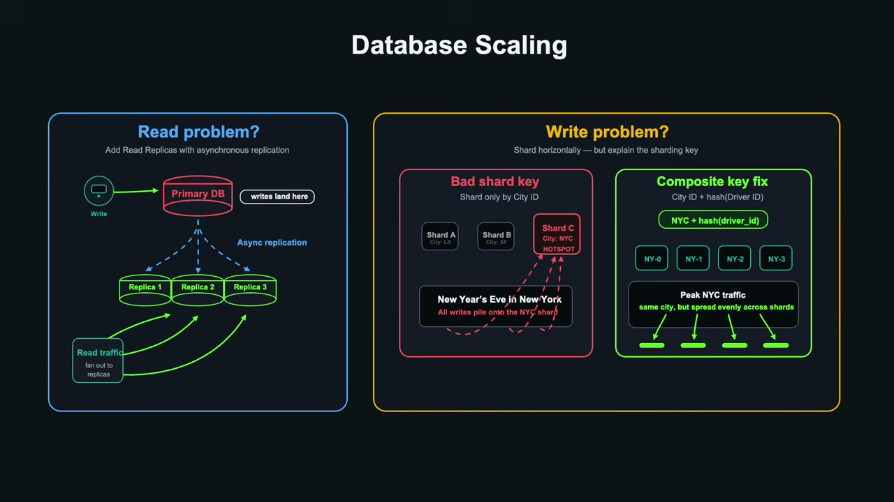
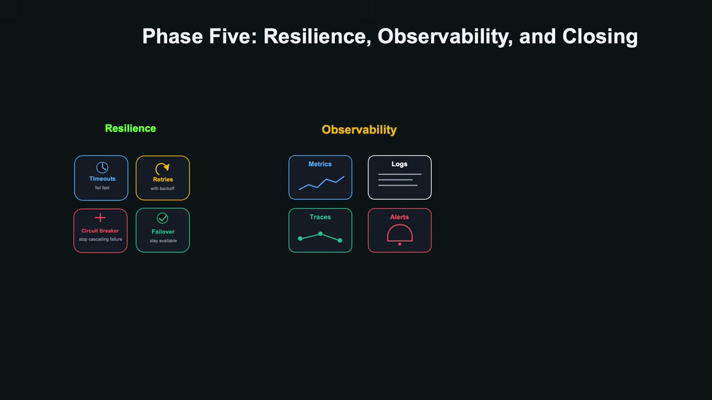

# How to Pass a System Design Interview (The 45-Minute Blueprint)

* **Source:** [YouTube - Code with Lucian](https://www.youtube.com/watch?v=HcC9Du6RWwk)
* **Category:** System Design
* **Target Level:** Mid-Level → Senior

---

## The Reality of System Design Interviews

Out of 100 engineers who apply to a role, around 75 pass the HR screen. Only 20 clear the coding round. System design then cuts the remaining pool in half again.

But here's the flip side: **system design is also the ultimate differentiator.** It is the round where you directly dictate your seniority level and the salary band you land in.

Interviewers are not counting how many buzzwords you drop. They are measuring **signal versus noise** - how you navigate ambiguity, how you justify trade-offs, and whether you think like a senior engineer when a system is under stress.

The biggest mistake mid-level engineers make is sitting back and waiting to be asked questions one by one. **Senior engineers take control and drive the interview.** The 45-minute blueprint below gives you the exact structure to do that.

---

## The 45-Minute Blueprint

| Phase | Time | Focus |
|---|---|---|
| 1 - Scope & Requirements | 0–5 min | Define the problem before drawing anything |
| 2 - Estimations & Contracts | 5–10 min | Justify hardware and protocol choices with math |
| 3 - High-Level Architecture | 10–20 min | Draw a minimal, functional 5-box system |
| 4 - Deep Dives & Bottlenecks | 20–35 min | Stress test and solve the hard scaling problems |
| 5 - Resilience & Observability | 35–45 min | Make the system reliable and monitorable |



---

## Phase 1: Scope & Requirements (0–5 min)

You are handed a vague prompt - *"Design Uber."* A mid-level engineer panics and immediately starts drawing database schemas. A senior engineer stops, takes a breath, and uses the first five minutes to **define the problem**.

### Functional Requirements
Limit yourself to **three core features maximum**. For Uber:
- Rider requests a ride
- Driver accepts the ride
- Real-time driver location tracking

That's it. Do not try to design surge pricing, ratings, or ride-sharing pools in the first five minutes.

### Non-Functional Requirements


This is where you establish SLAs (Service Level Agreements). Say this out loud to the interviewer:

> *"Before we look at components, I want to clarify our scale and SLAs. Do we need strong consistency for payments but eventual consistency for driver locations? What is the latency budget for location tracking - is under 500ms acceptable?"*

Those answers will shape every architectural decision downstream. Also ask about the **read-to-write ratio**. A 100:1 read-heavy system (like a news feed) looks completely different from an IoT logging service that is 99% writes.

### The Cardinal Sin of Phase 1
**Premature over-engineering.** If you pitch multi-region database sharding before confirming the system handles more than 10 requests per second, you are signalling zero engineering maturity.

**Rule of thumb:** Scope it tight, establish the SLAs, get agreement from your interviewer, then move on.

---

## Phase 2: Estimations & API Contracts (5–10 min)

Many engineers dread this phase because they think they are being tested on precise math. They burn 15 minutes obsessing over exact decimal places for storage calculations.

Your interviewer **does not care** if your multiplication is off by a few decimal points. They care about **order of magnitude** and what it implies for your hardware choices.

### Back-of-the-Envelope Estimation


Round aggressively:

- 10 million daily users doing 10 actions a day = 100 million events/day
- 100 million ÷ 100,000 seconds in a day = **~1,000 average QPS**, or ~2,000 at peak
- At 10 KB payload × 2,000 QPS = **20 MB/s of network bandwidth** - easily handled by a single instance
- If it were 2 GB/s, you would immediately know you need horizontal partitioning

Math is not busywork - it is **architectural justification**.

### API Contracts
Do not just say "we'll use APIs." Make specific statements:

- **REST over HTTPS** for ride booking - it is a stateless transactional operation. One request, one confirmation, connection closed.
- **WebSockets or Server-Sent Events (SSE)** for real-time driver location streaming - to avoid costly HTTP polling overhead.

### Data Model
Justify your storage choice based on access patterns:
- Need ACID compliance and relational integrity for payments? → **Relational (SQL)**
- Need ultra-low latency and geospatial indexing for driver coordinates? → **Specialised NoSQL (Redis, Cassandra)**

**Rule of thumb:** Keep calculations simple, define protocols explicitly, and always justify your storage choices.

---

## Phase 3: High-Level Architecture (10–20 min)

This is where mid-level engineers make a fatal mistake: trying to design Day 1,000 architecture on Day 1.

**Senior engineers build iteratively.** Start with a minimal foundation:

```
Client → Load Balancer → API Gateway → Application Service → Storage
```

### Trace the Happy Path


Walk your interviewer through a single end-to-end request:

> *"The mobile client sends a ride request to our load balancer, which terminates TLS and forwards it to the API gateway for authentication and rate limiting. The gateway routes it to the ride service, which writes to the database and returns a ride ID."*

### The Golden Rule
**Never draw a box without stating its purpose out loud.** Don't silently add a load balancer - say:

> *"We place a load balancer here to distribute peak traffic of 2,000 QPS across stateless application instances and perform health checks."*

### Separate Read and Write Paths
If 95% of traffic is users viewing driver locations on a map, those read queries should hit an in-memory cache or read replica - completely bypassing the transactional write database.

**Rule of thumb:** Keep the initial design embarrassingly simple. Prove the core system works logically before you try to scale it.

---

## Phase 4: Deep Dives & Bottlenecks (20–35 min)

This is the most critical phase. Your interviewer will stress-test the baseline:

> *"Your database is taking 20,000 writes per second during peak hours. How do you stop it from collapsing?"*

This is your opportunity to demonstrate senior engineering thinking.

### Caching Strategy
Don't just say "add a cache." Specify the pattern:

> *"We implement a cache-aside pattern using Redis. Read requests hit the cache first. On a miss, we load from the primary database, write back to the cache, and return the response."*

Manage memory with TTL and LRU (Least Recently Used) eviction policies.

### Database Scaling


- **Read pressure?** Add read replicas with asynchronous replication.
- **Write pressure?** Introduce sharding (horizontal partitioning).

**Critical: Choose your sharding key carefully.** If you shard an Uber database by `city_id`, what happens during New Year's Eve in New York? A massive hotspot on a single partition. The fix: use a composite key like `city_id + hash(driver_id)` to distribute peak traffic evenly across shards.

### Asynchronous Decoupling
For write surges, introduce a message queue:

> *"Instead of synchronously writing location updates to the database, we push events into a distributed queue (e.g., Kafka). Worker nodes pull from the queue at a controlled rate, giving us automatic backpressure protection during traffic spikes."*

### CAP Theorem Trade-offs
During a network partition you cannot have both strong consistency and high availability - you must explicitly choose one and justify it.

- **Driver location tracking** → prioritise **Availability (AP)**. A 2-second stale driver icon is acceptable.
- **Financial transactions** → prioritise **Consistency (CP)**. It is far better to reject a payment cleanly than to risk data corruption or double charging.

### Eliminate Single Points of Failure
Proactively scan your diagram for risks before the interviewer does:

> *"Our primary database node is currently a single point of failure. We'll set up multi-region automated failover with heartbeat health checks and a standby replica continuously streaming updates."*

**Rule of thumb:** Welcome bottlenecks as opportunities to showcase advanced patterns - event-driven queues, caching strategies, failover mechanics. Use them to demonstrate judgment, not ego.

---

## Phase 5: Resilience & Observability (35–45 min)

Most candidates think the interview ends when the architecture works on paper. Senior candidates know that **unmonitored systems are broken systems waiting to happen.**

Spend two minutes covering:



- **Distributed Tracing:** Inject a unique `trace_id` at the API gateway to track a single request across all microservices end-to-end.
- **Circuit Breakers:** If a downstream payment service slows down, a circuit breaker trips to prevent cascading failures across the entire system.

### Final Synthesis
Close by walking through the blueprint you have delivered:
- 0–5 min: Defined scope and SLAs
- 5–10 min: Calculated order of magnitude and established API contracts
- 10–20 min: Built a simple, functional 5-box architecture
- 20–35 min: Solved bottlenecks and justified trade-offs
- 35–45 min: Added reliability and observability

---

## The 3 Red Flags That Trigger Rejection

1. **Over-engineering too early** - pitching multi-region sharding before confirming baseline QPS.
2. **Defensiveness** - treating the interviewer's questions as attacks rather than opportunities to explore trade-offs.
3. **Bad clock management** - spending 25 minutes on math and running out of time for the architecture diagram.

---

## What Good Looks Like

If you execute this structure, you separate yourself from candidates who wander without direction. You demonstrate:

- **Leadership** - you drive the conversation
- **Structure** - you work through a clear, repeatable framework
- **Technical depth** - you reason from first principles
- **Communication** - you make your thinking visible and defensible under pressure

That is what a senior engineer looks like in a room.
